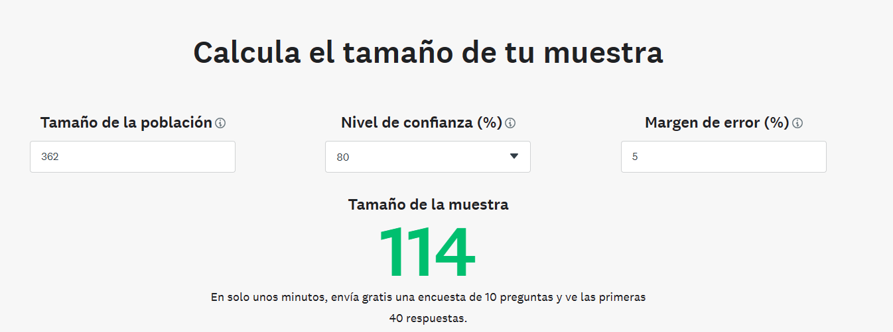

# Motor de busqueda usando indexación
- Anderson Alvarado
- Juan Páez
## Obteniendo palabras que no son relevantes para el índice
Para obtener esta lista de palabras se realizó un muestreo de los cursos, con el fin de 
obtener la información de estos, y saber cuáles son las palabras que no son relevantes 
para el índice.

Utilizando una calculadora online para obtener el tamaño de la muestra,
nos da este resultado:

Por lo tanto se ejecutó el código obteniendo **114** cursos con su respectiva información.

```python
def most_frecuent_words(words):
```
Esta función que se encuentra en utils.py en la clase UtilText, cumple la
función de generar un diccionario de palabras con su respectiva frecuencia.
Y a partir del resultado, se realizará un análisis de que palabras deberían omitirse
en la creación del índice.

A continuación, se presenta, parcialmente, el resultado al ejecutar la obtención
de estas palabras:
```json
{
  "aplica": 1756,
  "para": 1222,
  "como": 582,
  "universidad": 499,
  "salud": 389,
  "objetivos": 345,
  "curso": 282,
  "desarrollo": 267,
  "javeriana": 263,
  "seguridad": 253,
  "pontificia": 233,
  "herramientas": 229,
  "sobre": 209,
  "este": 207,
  "programa": 197,
  "trabajo": 191,
  "aprendizaje": 187,
  "unidad": 184,
  "proyectos": 183,
  "digital": 179,
  ...
}
```
A criterio de los autores de este taller, las palabras que se
repiten desde 100 veces en adelante, no genera valor al 
indexador a construir. Por lo tanto, seran omitidas.
